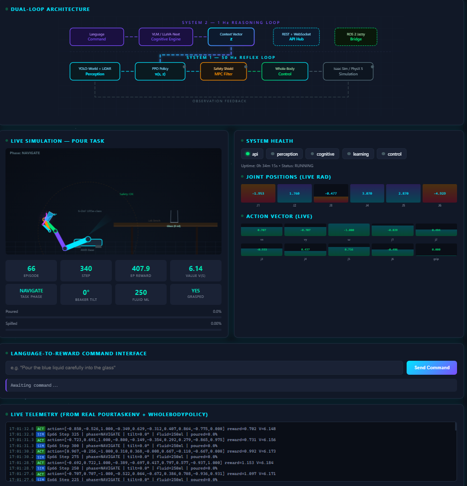

# PHILOS — PHysical IntelLigence, Learning, Optimization, and Semantics

> Foundation model for adaptive mobile manipulation — bridging language understanding,
> reinforcement learning, and deterministic safety control.

[](https://github.com/entanglenet/philos/actions/workflows/ci.yml)
[](https://python.org)
[](https://opensource.org/licenses/Apache-2.0)
[](https://developer.nvidia.com/isaac-sim)

<p align="center">
  
</p>

---

## Overview

PHILOS implements a **dual-loop cognitive architecture** for mobile manipulation robots,
designed to operate in safety-critical environments (chemical labs, industrial settings).

```
                    ┌─────────────────────────────────────────────┐
                    │           System 2 — Reasoning (1 Hz)       │
                    │  ┌─────────┐    ┌───────────────────────┐   │
  Language  ───────►│  │  VLM    │───►│  Semantic Reward      │   │
  Command           │  │ LLaVA   │    │  Shaping              │   │
                    │  └────┬────┘    └───────────┬───────────┘   │
                    │       │                     │               │
                    │       ▼                     │               │
                    │  Context Vector z ──────────┘               │
                    └───────┬─────────────────────────────────────┘
                            │
                            ▼
┌───────────────────────────────────────────────────────────────────┐
│               System 1 — Reflexes (50 Hz)                         │
│  ┌──────────┐   ┌──────────────┐   ┌──────────┐   ┌───────────┐ │
│  │YOLO-World│──►│ RL Policy    │──►│  Safety   │──►│ Actuators │ │
│  │ Detector │   │ π(s, z)      │   │  Shield   │   │ (MPC)     │ │
│  └──────────┘   └──────────────┘   └──────────┘   └───────────┘ │
│       ▲              ▲                   │                        │
│       │              │                   │  deterministic         │
│    Sensors      State s              override if unsafe           │
└───────────────────────────────────────────────────────────────────┘
```

### Key Features

- **Dual-Loop Architecture**: System 1 (50 Hz reflexes via YOLO-World + PPO) + System 2 (1 Hz reasoning via VLM/LLaVA-Next)
- **Context-Conditioned RL**: Policy π(s, z) takes a latent context vector z from the VLM instead of raw text
- **Deterministic Safety Shield**: Non-AI MPC that can override any RL action; platform tilt < 10°, EE velocity < 1.5 m/s
- **Domain Randomization**: ±200% physics parameter variation for robust sim-to-real transfer
- **NVIDIA Isaac Sim**: PhysX 5 fluid simulation, 64+ parallel environments
- **Loosely Coupled Modules**: Component registry + FastAPI for inter-module communication
- **ROS2 Jazzy**: Deterministic middleware for real hardware deployment

---

## Architecture

```
philos/
├── core/                   # Configuration, state, registry
│   ├── config.py           # Hierarchical YAML-based config
│   ├── context_vector.py   # The z vector (VLM → RL bridge)
│   ├── state.py            # Robot state representation
│   └── registry.py         # Component registry (loose coupling)
│
├── api/                    # REST + WebSocket API
│   ├── schemas.py          # Pydantic v2 data contracts
│   └── server.py           # FastAPI server (all endpoints)
│
├── perception/             # System 1 + System 2 perception
│   ├── yolo_world.py       # 50 Hz open-vocabulary detector
│   ├── vlm_grounding.py    # 1 Hz VLM → context vector
│   └── sensor_fusion.py    # RGB-D + LiDAR fusion
│
├── cognitive/              # Semantic reasoning
│   ├── reward_shaping.py   # Language → reward weights
│   └── base.py             # Abstract cognitive engine
│
├── learning/               # RL training
│   ├── policies/
│   │   └── whole_body.py   # PPO actor-critic (512-256-128)
│   ├── reward_functions.py # 10 composable reward components
│   └── domain_randomization.py
│
├── control/                # Deterministic safety layer
│   ├── safety_shield.py    # 50 Hz MPC safety filter
│   ├── mpc_solver.py       # Whole-body MPC (QP)
│   └── trajectory.py       # Min-jerk & spline planning
│
├── simulation/             # NVIDIA Isaac Sim environments
│   ├── isaac_env.py        # Gymnasium-compatible base
│   ├── domain_randomizer.py
│   └── environments/
│       ├── pour_task.py    # "The Sommelier" (fluid pouring)
│       └── fetch_sort_task.py  # "The Courier" (pick & place)
│
├── ros2_bridge/            # ROS2 Jazzy integration
│   ├── bridge.py           # Main ROS2 node (50 Hz loop)
│   ├── topics.py           # All topic definitions
│   └── transforms.py       # TF2 frame management
│
└── evaluation/             # Benchmarking & KPI tracking
    ├── benchmarks.py       # Evaluation campaign runner
    └── metrics.py          # PHILOS KPIs (spill, grasp, etc.)
```

---

## Quick Start

### Installation

```bash
# Clone
git clone https://github.com/entanglenet/philos.git
cd philos

# Install (base)
pip install -e .

# Install with dev tools
pip install -e ".[dev]"

# Install with Isaac Sim support
pip install -e ".[isaac-sim]"

# Install everything
pip install -e ".[all]"
```

### Train an RL Policy

```bash
# Train on the pouring task (stub mode, no Isaac Sim required)
python scripts/train_rl.py --env pour_task --total-timesteps 1000000

# Train with Isaac Sim (requires NVIDIA Isaac Sim installation)
python scripts/train_rl.py --env pour_task --num-envs 64 --total-timesteps 10000000

# With Weights & Biases logging
python scripts/train_rl.py --env pour_task --wandb
```

### Evaluate a Trained Policy

```bash
python scripts/evaluate.py --checkpoint checkpoints/best_policy.pt --env pour_task --episodes 100
```

### Launch the API Server

```bash
python scripts/launch_api.py --port 8000

# Endpoints:
#   POST /api/v1/command     — Send language command
#   GET  /api/v1/context     — Get current context vector
#   POST /api/v1/state       — Update robot state
#   GET  /api/v1/action      — Get policy action
#   GET  /api/v1/safety      — Safety shield status
#   GET  /api/v1/health      — System health
#   WS   /ws/telemetry       — Real-time telemetry stream
```

### Docker

```bash
# Build
docker build -t philos .

# Run API server
docker compose up api

# Run training (requires NVIDIA GPU)
docker compose --profile training up training

# Run evaluation
docker compose --profile evaluation up evaluation
```

---

## Configuration

All configuration is in YAML files under `configs/`:

| File | Description |
|------|-------------|
| `configs/default.yaml` | Full system configuration |
| `configs/training/ppo_config.yaml` | RL training hyperparameters |
| `configs/safety/constraints.yaml` | Safety shield hard limits |

Override any parameter:
```bash
python scripts/train_rl.py --config configs/training/ppo_config.yaml
```

---

## PHILOS Pipeline

The full Semantic-to-Control pipeline:

1. **Language Command** → Operator says "carefully pour 250ml into the beaker"
2. **VLM Grounding** (1 Hz) → LLaVA-Next produces Context Vector z = {mode: FLUID, impedance: 0.3, ...}
3. **Perception** (50 Hz) → YOLO-World detects beaker, flask, liquid level
4. **RL Policy** → π(state, z) outputs whole-body action [base_vel, joints, gripper]
5. **Safety Shield** (50 Hz) → Deterministic MPC clips/overrides unsafe commands
6. **Actuators** → ROS2 publishes joint trajectories and base velocity

---

## Key Performance Indicators (KPIs)

From the PHILOS proposal validation targets:

| KPI | Target | Module |
|-----|--------|--------|
| Spill rate | < 5% | Simulation + Control |
| Grasp success | > 90% | Learning + Perception |
| Object ID accuracy | > 95% | Perception (VLM) |
| Placement accuracy | < 2 cm | Learning + Control |
| Control latency | < 10 ms | ROS2 Bridge |
| Safety violations | 0 | Safety Shield |
| Platform tilt | < 10° | Safety Shield |

---

## Development

```bash
# Run tests
pytest tests/ -v

# Lint
ruff check philos/ tests/

# Type check
mypy philos/ --ignore-missing-imports

# Format
ruff format philos/ tests/
```

---

## Work Packages Mapping

| WP | Name | PHILOS Modules |
|----|------|----------------|
| WP1 | Management | — |
| WP2 | Brain (VLM + RL) | `perception/`, `cognitive/`, `learning/` |
| WP3 | Body (ROS2 + Control) | `control/`, `ros2_bridge/` |
| WP4 | Exam (Validation) | `simulation/`, `evaluation/` |
| WP5 | Market | `api/` |

---

## Technology Stack

- **Simulation**: NVIDIA Isaac Sim / Omniverse / PhysX 5
- **RL Framework**: PyTorch + Gymnasium
- **Perception**: YOLO-World (System 1), LLaVA-Next (System 2)
- **Control**: Deterministic MPC Safety Shield
- **Middleware**: ROS2 Jazzy Jalisco
- **API**: FastAPI + Pydantic v2
- **CI/CD**: GitHub Actions + Docker

---

## License

Apache License 2.0 — see [LICENSE](LICENSE).

---

**PHILOS** is developed by [Entanglenet GmbH](https://entanglenet.ai) as part of the
EIC Horizon Europe Transition programme.
